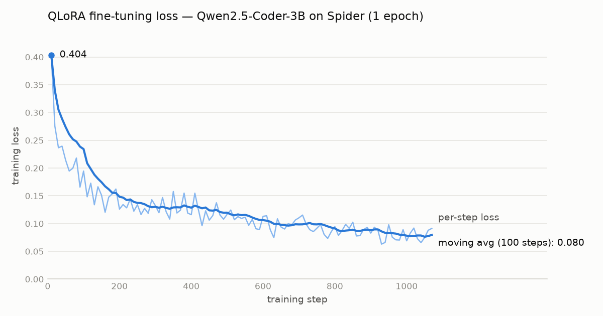

# Local Text-to-SQL

자연어 질문을 SQL로 바꿔 실행해 주는 **로컬 LLM**입니다.
오픈소스 코드 모델(Qwen2.5-Coder)을 Spider 데이터셋으로 QLoRA 파인튜닝하고, Ollama로 로컬에서 서빙합니다.

```
질문 ─▶ FastAPI ─▶ 스키마 + 질문 프롬프트 ─▶ Ollama(파인튜닝 모델) ─▶ SQL
                                                                  │
          결과 ◀── 읽기 전용 · 권한 제한 · 타임아웃이 걸린 SQLite 실행 ◀┘
```

## 결과

Spider dev 세트 전체(1,034문제, DB 20개)의 실행 정확도(Execution Accuracy)입니다. 실험을 진행하면서 채웁니다.

| 모델 | 방식 | EX | SQL 오류율 | 평균 지연(CPU) |
|---|---|---|---|---|
| Qwen2.5-Coder-3B | zero-shot | 61.8% | 13.4% | 5.52s |
| Qwen2.5-Coder-3B | + 예시 행 3개 | - | - | - |
| Qwen2.5-Coder-3B | QLoRA 파인튜닝 | 73.4% | 6.1% | 5.04s |
| Qwen2.5-Coder-3B | zero-shot + self-correction | 62.6% | 10.3% | 7.57s |
| Qwen2.5-Coder-3B | QLoRA 파인튜닝 + self-correction | **74.4%** | **3.6%** | 5.97s |

### 파인튜닝 전후 비교

같은 1,034문제에서 **EX +11.6%p (61.8% → 73.4%)**, SQL 오류율은 절반 이하(13.4% → 6.1%)로 줄었습니다.
문제별로 보면 176문제가 새로 맞고 56문제가 새로 틀려 순증 120문제입니다. 부호 검정 기준 z ≈ 7.9로, 우연으로 보기 어려운 차이입니다.

| SQL 유형 | 파인튜닝 전 | 파인튜닝 후 | 변화 |
|---|---|---|---|
| 단순 조회 | 78.1% | 88.3% | +10.2%p |
| ORDER BY | 62.4% | 74.7% | +12.2%p |
| GROUP BY | 51.6% | 66.4% | +14.8%p |
| JOIN | 51.2% | 59.6% | +8.3%p |
| 집합 연산 | 43.8% | 58.8% | +15.0%p |
| 중첩 쿼리 | 37.3% | 50.6% | +13.3%p |

| 오답 구분 | 파인튜닝 전 | 파인튜닝 후 |
|---|---|---|
| 실행 오류: 존재하지 않는 컬럼 | 129 | 61 |
| 실행 오류: 존재하지 않는 테이블 / 모호한 컬럼 / 기타 | 10 | 2 |
| 실행은 되지만 결과가 틀림 | 256 | 212 |

- **가장 큰 변화는 "불필요한 JOIN"이 사라진 것**입니다. 베이스라인은 `singer` 테이블 하나로 답할 수 있는 질문에도 테이블 3~5개를 JOIN하다가, 없는 `song` 테이블이나 엉뚱한 별칭(`T2.Country`)을 만들어 냈습니다. 파인튜닝 모델은 필요한 테이블만 씁니다.
  - 질문: *What is the name and capacity for the stadium with highest average attendance?*
  - 전: `SELECT T2.Name, T2.Capacity FROM stadium AS T1 JOIN concert AS T2 ... ORDER BY T1.Average DESC LIMIT 1` → `no such column: T2.Name`
  - 후: `SELECT name, capacity FROM stadium ORDER BY average DESC LIMIT 1` ✓
- 설명문이나 코드펜스 없이 **SQL 한 줄만** 출력하게 되어 응답이 짧아졌고, 평균 지연도 9% 줄었습니다.
- 어려운 DB에서 개선 폭이 컸습니다: `course_teach` 37% → 70%, `world_1` 37% → 52%, `car_1` 34% → 49%.
- **나빠진 사례(56문제)**:
  - 학습 데이터 스타일의 컬럼명을 지어내는 경우가 있습니다. 예: 실제 `PetType` 대신 `pet_type`, `ContId` 대신 `ContinentId`. 남은 "존재하지 않는 컬럼" 오류 61건 중 33건이 `car_1`과 `world_1`에 몰려 있습니다. → self-correction 루프로 줄일 계획입니다.
  - "oldest to youngest"를 `ASC`로 쓰는 등 정렬 방향을 반대로 쓰거나, `count(*), country`처럼 컬럼 순서를 바꾼 경우도 있습니다.
- 참고로, 이 평가는 컬럼 순서까지 비교하는 엄격한 방식입니다. 행 값은 같고 컬럼 순서만 다른 오답이 베이스라인 39건, 파인튜닝 32건으로 비슷해서, 이 방식이 비교 결과를 한쪽으로 치우치게 하지는 않습니다.

상세 비교는 `python scripts/compare.py outputs/preds_base-3b_eval.jsonl outputs/preds_ft-3b_eval.jsonl`로 재현할 수 있습니다.

### Self-correction 실험

실행 오류가 난 SQL만 SQLite 오류 메시지와 함께 모델에 다시 보여 주고 고치게 했습니다 (최대 2회). 정답 SQL은 쓰지 않으므로 실제 서비스에서도 같은 효과를 기대할 수 있습니다.

| | 재시도한 문제 | 실행 성공으로 바뀜 | 그중 정답 | EX 변화 | 평균 지연 변화 |
|---|---|---|---|---|---|
| zero-shot | 139 | 33 | 8 | +0.8%p | +2.05s |
| 파인튜닝 | 63 | 26 | 10 | +1.0%p | +0.93s |

- 실행 오류는 크게 줄었지만(파인튜닝 6.1% → 3.6%) **정답률 상승은 1%p 안팎**에 그쳤습니다. 오류만 없앤 SQL의 60% 이상은 여전히 답이 틀렸습니다.
- **잘 고친 경우는 이름을 살짝 틀린 경우**입니다. 예: `pet_type` → `pettype`, 별칭 `T2.PetType` → `T1.PetType`, 모호한 `PetID` → `T2.PetID`.
- **가장 큰 한계는 "같은 SQL 반복"**입니다. temperature 0에서 오류 메시지를 줘도 직전 SQL을 그대로 다시 쓴 경우가 zero-shot 65%(91/139), 파인튜닝 40%(25/63)였습니다. 없는 `song` 테이블처럼 잘못된 생각에서 출발한 SQL은 거의 고치지 못했습니다.
- 2번째 시도는 거의 도움이 되지 않았습니다. 성공의 대부분(파인튜닝 26건 중 24건)이 1번째 시도에서 나왔습니다.

#### 개선 시도: 컬럼 목록 힌트, 반복 시 재샘플링

"같은 SQL 반복"을 줄이려고 두 가지를 더 시험했습니다 (파인튜닝 모델, 같은 63문제).

| 방식 | 실행 성공으로 바뀜 | 그중 정답 | 직전 SQL 반복 | 전체 EX | 평균 지연 |
|---|---|---|---|---|---|
| 오류 메시지만 (기본) | 26 | **10** | 25 | **74.4%** | **5.97s** |
| + 테이블별 실제 컬럼 목록, "반복 금지" 지시 | 17 | 7 | 38 | 74.1% | 6.38s |
| + 위 방식 + 반복 시 temperature 0.7로 재샘플링 | 22 | 8 | 31 | 74.2% | 6.66s |

- **둘 다 기본 방식보다 나아지지 않았습니다.** 컬럼 목록은 `pet_type` → 실제 이름 `PetType`처럼 정확히 고치는 경우를 만들었지만, 프롬프트가 길어지자 직전 SQL을 그대로 베끼는 경우가 오히려 늘었습니다. "반복하지 말라"는 지시도 3B 모델에는 거의 통하지 않았습니다.
- 재샘플링은 46번 실행됐지만 temperature 0.7에서도 같은 SQL이 다시 나오는 경우가 많았습니다.
- 세 방식이 고친 문제를 모두 합쳐도 11개로, 대부분 겹칩니다. 63문제 중 프롬프트만으로 고칠 수 있는 문제는 10개 안팎이 한계로 보입니다.
- **결론**: 이 모델 크기에서는 지시를 더하는 것보다 단순한 기본 방식이 가장 낫습니다. 더 개선하려면 오류 수정 대화를 학습 데이터에 넣어 모델이 고치는 법 자체를 배우게 해야 합니다.

### 베이스라인 오류 분석 (zero-shot)

정답 SQL의 구성 요소별 정답률입니다. 한 문제가 여러 유형에 속할 수 있습니다.

| 유형 | 정답률 |
|---|---|
| 단순 조회 | 78.1% (260/333) |
| ORDER BY | 62.4% (148/237) |
| GROUP BY | 51.6% (143/277) |
| JOIN | 51.2% (209/408) |
| 집합 연산 (INTERSECT/EXCEPT/UNION) | 43.8% (35/80) |
| 중첩 쿼리 | 37.3% (31/83) |

- 오답 395건 = 실행 오류 139건(존재하지 않는 컬럼 129, 테이블 5, 모호한 컬럼 5) + 실행은 되지만 결과가 틀림 256건
- 주원인은 **스키마 연결 실패**입니다. 테이블 별칭을 혼동하거나, 엉뚱한 테이블을 JOIN하거나, GROUP BY 조건을 빠뜨렸습니다.
- DB별 편차가 큽니다: `car_1` 34%, `world_1` 37% ↔ `poker_player` 98%, `orchestra` 95%
- Spider 정답 자체의 오류도 발견했습니다. 예: "dog는 있고 cat은 없는 학생의 first name" 질문에 정답 SQL이 `fname, age`를 출력합니다.

### 학습 과정 (QLoRA)



| 항목 | 값 |
|---|---|
| 학습 데이터 | Spider train 8,659문제, 1 epoch (약 1,080 step) |
| 설정 | 4bit QLoRA, r=16, alpha=16, lr 2e-4 (cosine), 배치 2 × 누적 4, Colab T4 |
| Loss | 0.404 (step 10) → **0.080** (마지막 100 step 평균), 최저 0.063 |

- 처음 200 step 안에 Loss가 절반 이하로 떨어진 뒤 끝까지 완만하게 내려갔습니다. 출렁임은 있지만 `nan`이나 급등 없이 안정적으로 수렴했습니다.
- `train_on_responses_only`로 SQL 부분에만 Loss를 계산하므로, 위 값은 "정답 SQL을 얼마나 그대로 써내는가"를 뜻합니다.
- 학습 Loss는 학습 데이터 기준이라 일반화 성능을 보장하지 않습니다. 실제 성능은 학습에 쓰지 않은 dev 세트의 실행 정확도로 판단합니다.

## 한국어 평가 (직접 구축)

Spider는 영어 질문뿐이라, 한국어 질문에서도 쓸 만한지 확인하려고 평가셋을 직접 만들었습니다.

- **DB**: 가상 쇼핑몰 (`customers`, `categories`, `products`, `orders`, `order_items`, `reviews`). 고객 200명, 주문 800건, 리뷰 380건. 이름은 영어, 값은 한국어(`'서울'`, `'취소'`)인 국내 서비스에서 흔한 형태입니다. `scripts/build_shop_db.py`가 고정 seed로 생성합니다.
- **질문 100개**: 쉬움 25, 보통 35, 어려움 40. "~야?", "~줘", "~인가요?"를 섞고, 매출/판매액, 고객/회원처럼 같은 뜻의 다른 표현을 넣었습니다.
- **정답 검증**: `scripts/prepare_korean.py`가 정답 SQL을 실행해 빈 결과(엉터리 SQL도 우연히 맞을 수 있음)와 `LIMIT`의 동점(정답이 모호함)을 찾습니다. 이 검사로 4문제를 고쳤습니다.

| 모델 | EX | SQL 오류율 | 쉬움 | 보통 | 어려움 |
|---|---|---|---|---|---|
| Qwen2.5-Coder-3B (zero-shot) | **71%** | 12% | 96% | 77% | **50%** |
| QLoRA 파인튜닝 (Spider) | 66% | 13% | 96% | **83%** | 33% |

**Spider에서 +11.6%p였던 파인튜닝이 한국어 쇼핑몰 DB에서는 -5%p였습니다.** 차이는 테이블을 여러 개 이어야 하는 문제에 몰려 있습니다.

| 정답 SQL의 JOIN 수 | 문제 수 | zero-shot | 파인튜닝 |
|---|---|---|---|
| 0 | 58 | 74% | 78% |
| 1 | 28 | 68% | 68% |
| 2 이상 | 14 | **64%** | **14%** |

- 파인튜닝 모델은 중간 테이블을 건너뛰었습니다. "카테고리별 매출"에서 수량이 있는 `order_items`를 빼고 `orders`와 `products`를 바로 잇거나, `order_items`에 없는 `status`, `customer_id`를 거기서 찾았습니다.
- Spider에서는 "불필요한 JOIN을 줄이는" 버릇이 정확도를 크게 올렸습니다. 같은 버릇이 `orders → order_items → products → categories`처럼 긴 경로가 꼭 필요한 DB에서는 독이 된 것으로 보입니다. (Spider 학습 데이터에도 JOIN 2개 이상이 18% 있어서, 단순히 학습 데이터에 없어서 생긴 문제는 아닙니다.)
- Spider 정답의 습관도 따라 했습니다. `count(*)`를 먼저 출력해 컬럼 순서가 바뀌거나(2건), "0과 1 사이 비율"을 요청했는데 100을 곱했습니다.
- 반대로 한국어 조건을 읽는 능력은 좋아졌습니다. zero-shot은 "**5점** 리뷰를 못 받은 상품"에서 5점 조건을 빠뜨리거나, "**3월**에 들어온 주문"을 3월 1일 이후 전체로 셌는데, 파인튜닝 모델은 둘 다 맞혔습니다.
- 100문제 규모라 통계적 한계가 있습니다. 전체 차이(새로 맞음 6, 새로 틀림 11)는 부호 검정 z ≈ -1.2로 유의하지 않고, 어려움 난이도만 보면 z ≈ -2.1입니다.

**시사점**: 공개 벤치마크 점수 향상이 실제 서비스 DB 성능을 보장하지 않습니다. 다음 단계는 여러 테이블을 잇는 한국어 학습 데이터를 만들어 추가 학습하는 것입니다.

## 구조

```
src/text2sql/
  prompt.py      학습·추론 공통 프롬프트 + 모델 출력에서 SQL 추출
  schema.py      SQLite → CREATE TABLE 스키마 텍스트
  executor.py    안전한 SQL 실행 (읽기 전용 + authorizer + 타임아웃)
  evaluate.py    실행 정확도 계산
  llm.py         Ollama 클라이언트
  correct.py     self-correction (실행 오류 메시지로 SQL 재작성)
scripts/
  prepare_spider.py   Spider → chat 형식 JSONL
  predict.py          모델로 dev 세트 SQL 생성 (중단 후 이어서 실행 가능)
  evaluate.py         정확도·오류율·지연시간 집계
  compare.py          두 모델 결과 비교 (유형별·DB별·좋아진/나빠진 사례)
  self_correct.py     실행 오류가 난 SQL만 오류 메시지와 함께 다시 고치기
  plot_loss.py        Colab 학습 로그 → Loss 그래프 (pip install -e ".[plot]")
  build_shop_db.py    한국어 평가용 가상 쇼핑몰 DB 생성
  prepare_korean.py   한국어 질문 검증 → 평가용 JSONL
  export_demo_data.py 화면에 보여 줄 실측 데이터 → web/src/data/
data/korean/questions.json  한국어 질문 100개 + 정답 SQL
train/finetune_unsloth.py   Colab T4용 QLoRA 학습 → GGUF 변환
app/main.py                 FastAPI 서버 (/api/query, /api/health, /api/databases, /api/schema) + 화면 제공
web/                        데모 화면 (React + Vite + Tailwind)
models/Modelfile            파인튜닝 GGUF를 Ollama에 등록하는 설정
tests/                      실행기 보안·평가 로직·API 테스트
Dockerfile, docker-compose.yml   Ollama + API + 화면을 한 번에 실행
```

## 실행 방법

```bash
python -m venv .venv
.venv\Scripts\activate
pip install -e ".[dev]"
pytest
```

### 1. 데이터 준비
[Spider 공식 사이트](https://yale-lily.github.io/spider)에서 `spider_data.zip`을 받아 `data/spider/`에 풉니다.
`data/spider/database/`, `train_spider.json`, `dev.json`이 있어야 합니다.

```bash
python scripts/prepare_spider.py
```

### 2. 베이스라인 측정
```bash
ollama pull qwen2.5-coder:3b
python scripts/predict.py --model qwen2.5-coder:3b --tag base-3b --limit 200
python scripts/evaluate.py outputs/preds_base-3b.jsonl
```

### 3. 파인튜닝 (Google Colab)
`data/sft/train.jsonl`을 Colab에 올리고 `train/finetune_unsloth.py`를 셀 단위로 실행합니다.
생성된 `.gguf`를 내려받아 Ollama에 등록합니다.

```bash
ollama create text2sql-ft -f models/Modelfile
python scripts/predict.py --model text2sql-ft --tag ft-3b
python scripts/evaluate.py outputs/preds_ft-3b.jsonl
python scripts/compare.py outputs/preds_base-3b_eval.jsonl outputs/preds_ft-3b_eval.jsonl
```

### 4. 한국어 평가
```bash
python scripts/build_shop_db.py
python scripts/prepare_korean.py
python scripts/predict.py --data data/korean/dev_ko.jsonl --model text2sql-ft --tag ko-ft-3b
python scripts/evaluate.py outputs/preds_ko-ft-3b.jsonl --db-root data/korean/database
python scripts/compare.py outputs/preds_ko-base-3b_eval.jsonl outputs/preds_ko-ft-3b_eval.jsonl --levels data/korean/questions.json
```

### 5. 데모 화면 (로컬)
```bash
cd web
npm install
npm run build
cd ..
uvicorn app.main:app
```
`http://localhost:8000`에서 데모를, `http://localhost:8000/docs`에서 API를 볼 수 있습니다.
화면을 고치면서 볼 때는 `uvicorn`을 켜 둔 채 `web/`에서 `npm run dev`를 실행하고 `http://localhost:5173`을 엽니다.

환경변수: `BASE_MODEL`(기본 `qwen2.5-coder:3b`), `FT_MODEL`(기본 `text2sql-ft`), `OLLAMA_URL`, `DB_ROOT`(Spider DB), `KOREAN_DB_ROOT`.

### 6. Docker Compose
`models/`에 GGUF 파일과 `Modelfile`을 넣은 뒤 Docker Desktop을 켜고 실행합니다.
```bash
docker compose up --build
```
처음 한 번은 베이스라인 모델 다운로드(약 2GB)와 파인튜닝 모델 등록으로 몇 분 걸립니다. `data/spider/`가 있으면 Spider DB도 함께 보입니다.

## 데모 화면

질문 하나가 **영수증 한 장**으로 인쇄됩니다. SQL은 주문 내역, 결과 행은 품목, 걸린 시간은 합계입니다.

- **계산대**: DB와 모델(베이스라인 / 파인튜닝 / 둘 다 비교)을 고르고 질문을 인쇄합니다. 비교 모드에서는 두 영수증이 나란히 나오고, 결과 행이 같은지 표시합니다.
- **자동수정**: 켜면 실행 오류가 난 SQL이 빨간 `VOID` 줄로 지워지고 고친 SQL이 이어서 인쇄됩니다. 같은 SQL을 반복하면 그렇다고 적습니다.
- **한국어 평가 100문제 카탈로그**: 칸마다 두 모델의 실측 채점 결과가 표시되고, 누르면 그 질문이 입력됩니다.
- **정산 리포트**: Spider·한국어·자동수정·학습 Loss 결과를 POS 일일 정산표(Z리포트) 형식으로 정리합니다. 숫자는 `scripts/export_demo_data.py`와 README의 실측값에서 가져옵니다.

디자인 원칙은 `PRODUCT.md`와 `DESIGN.md`에 있습니다.

## 설계 메모

- **보안은 DB 계층에서 처리**: "DROP 포함 여부" 같은 문자열 검사는 우회가 쉽습니다. 그래서 SQLite를 읽기 전용으로 열고, `set_authorizer`로 SELECT/READ 외 모든 동작(PRAGMA, ATTACH 포함)을 거부하며, 실행 시간도 제한합니다.
- **문자열 비교 대신 실행 결과 비교**: `WHERE city = 'Seoul'`과 `WHERE city IN ('Seoul')`은 같은 답입니다. 정답 판정은 결과 행을 비교합니다.
- **응답 부분만 학습**: `train_on_responses_only`로 SQL 토큰에만 손실을 계산합니다.

## 로드맵

- [x] 베이스라인 측정 (zero-shot)
- [ ] 베이스라인 측정 (예시 행 포함)
- [x] QLoRA 파인튜닝 및 비교
- [x] 오류 분석: JOIN·GROUP BY·중첩 쿼리 등 유형별 실패 사례 정리
- [x] **한국어 확장**: 가상 쇼핑몰 DB + 직접 만든 한국어 질문 평가셋(100개)
- [ ] 여러 테이블을 잇는 한국어 학습 데이터로 추가 학습
- [x] 실행 오류 시 에러 메시지를 모델에 다시 주는 self-correction 루프
- [x] self-correction 개선 실험: 컬럼 목록 힌트, 재시도 temperature (효과 없음, 기본 방식 유지)
- [ ] 오류 수정 대화를 포함한 추가 학습
- [x] 데모 화면(영수증 프린터), Docker Compose
- [ ] README에 데모 GIF 추가, GitHub 공개
