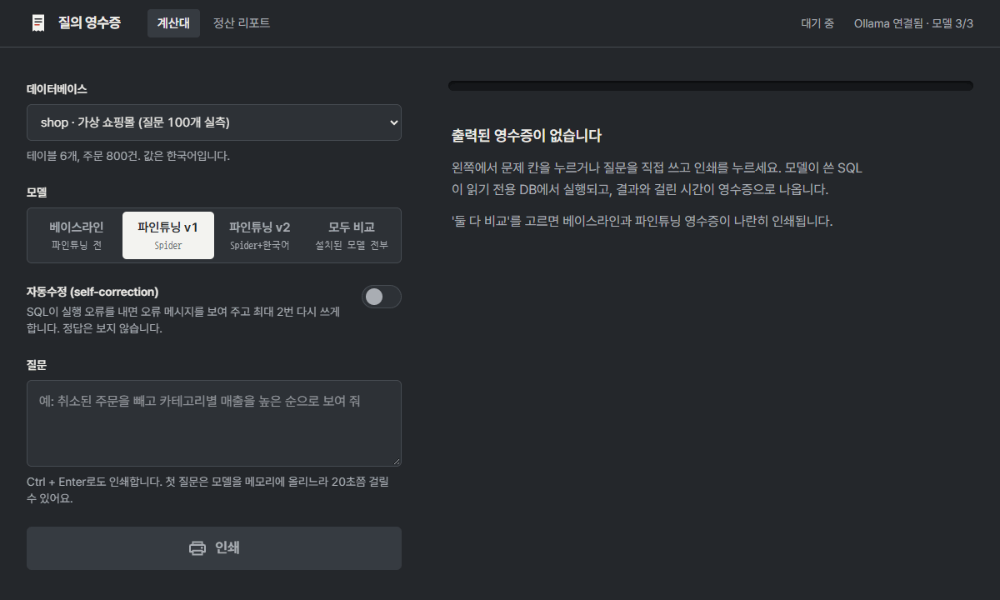
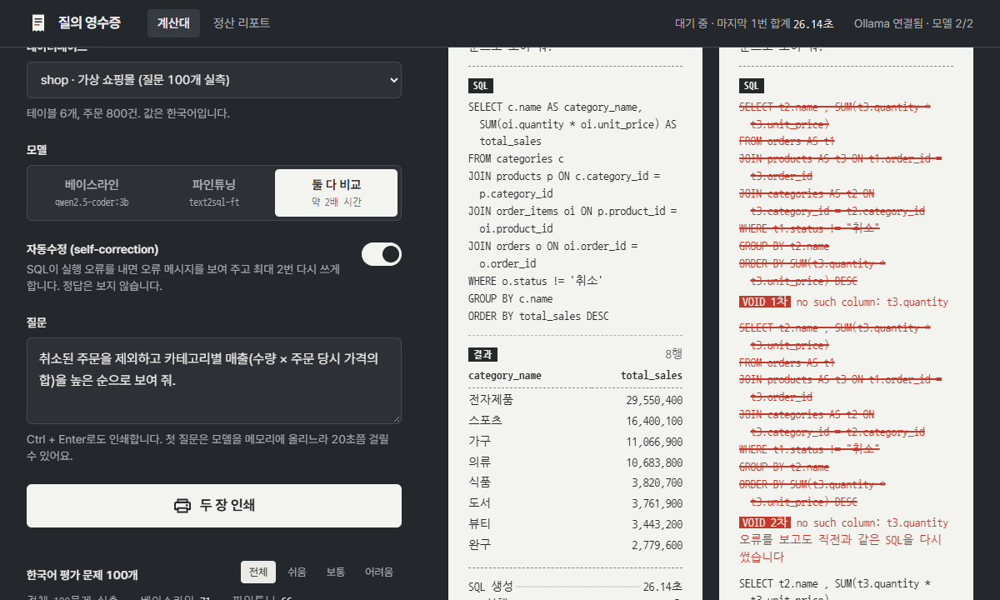
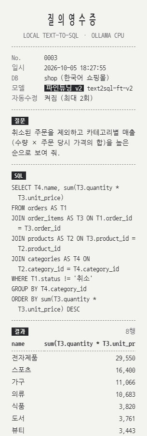
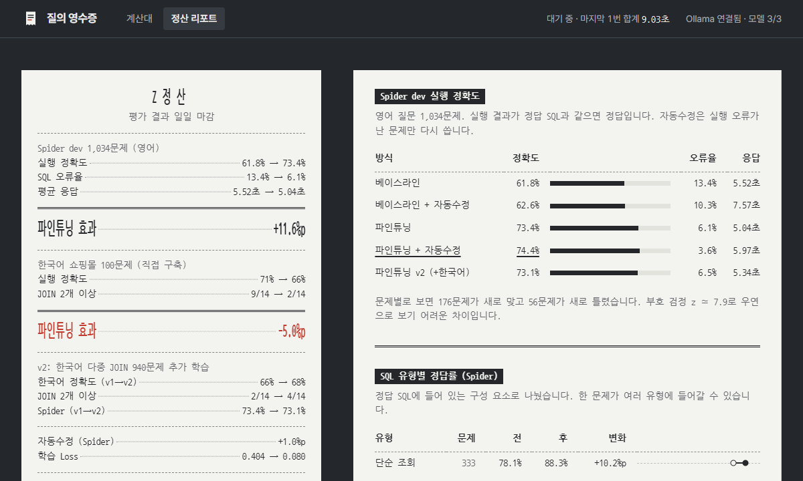
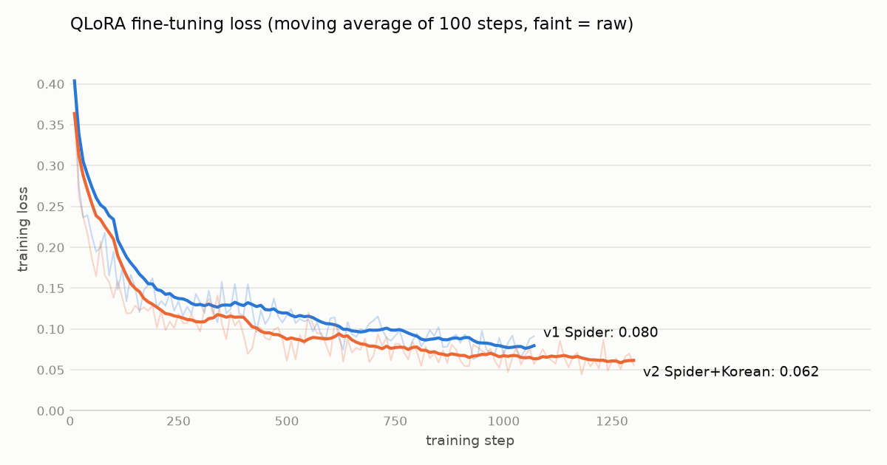

# Local Text-to-SQL

자연어 질문을 SQL로 바꿔 실행해 주는 **로컬 LLM**입니다.
오픈소스 코드 모델(Qwen2.5-Coder-3B)을 Spider 데이터셋으로 QLoRA 파인튜닝하고, Ollama로 CPU에서 서빙합니다.



<sub>실제 실행 화면입니다. 모델이 SQL을 쓰는 대기 시간(CPU에서 문제당 5~30초)만 줄여서 보여 줍니다.</sub>

| 무엇을 했나 | 결과 |
|---|---|
| Spider dev 1,034문제로 파인튜닝 전후 비교 | 실행 정확도 **61.8% → 73.4% (+11.6%p)**, SQL 오류율 13.4% → 6.1% |
| 실행 오류를 모델에 다시 보여 주는 self-correction | +1.0%p. 효과가 작은 원인(같은 SQL 반복 40~65%)을 측정하고, 개선 시도 2가지가 효과 없음을 확인 |
| 직접 만든 **한국어 쇼핑몰 평가셋 100문제** | 파인튜닝 모델이 오히려 **70% → 67%**. JOIN 2개 이상 문제에서 57% → 14%로 무너지는 약점 발견 |
| 약점을 겨냥한 v2 학습 (다른 DB 4개로 만든 한국어 다중 JOIN 940문제 추가) | JOIN 2개 이상 2/14 → 5/14로 **일부만 개선**, 한국어 전체는 67% 그대로. Spider는 73.4% → 73.1%로 유지. 베이스라인(8/14)은 여전히 못 넘음 |
| **외부 LLM 4곳이 쓴 질문 118개로 재검증** | 말투 이점은 없었고 v1의 약점이 더 크게 드러남(베이스라인 73.7% vs v1 61.0%). v2는 다중 JOIN을 17% → 27%로 고쳤지만 **필요 없는 JOIN을 붙이는 반대 실수**가 생김 |
| **v3: JOIN 필요·불필요 질문의 균형** (JOIN 0 / 1 / 2개 이상 = 50 / 15 / 35%) | 외부 118문항 61.0% → **69.5%**. JOIN 0개는 베이스라인 수준(90%)으로 회복하면서 2개 이상도 27% → 37%. 직접 만든 100문제는 67%, Spider는 72.1%로 v2와 같은 수준. Kaggle 학습 중 Loss가 nan이 되는 문제를 찾아 해결 |
| **학습 없이 올리기 1: 7B 베이스라인** | 3B를 아무리 가르쳐도 못 넘던 한국어 정확도를 **모델 크기만 키워서** 넘음. 외부 118문항 73.7% → **86.4%**, 직접 만든 100문제 70% → 79%. JOIN 2개 이상은 41% → 78%. 대신 응답 시간 2배 (6.8초 → 13.6초) |
| **학습 없이 올리기 2: 실행 결과 다수결** | 모델 여러 개가 쓴 SQL을 실행해 결과가 같은 쪽을 고름. 서로 다른 모델 5개를 섞으면 Spider에서 v3 혼자 71.9% → **75.3%**(z ≈ 4.1), 한국어 외부 118문항에서 73.7% → 80.5%. **같은 모델의 변형만 섞은 3개 다수결은 오히려 손해**(70.6%)였고 그 이유를 표 수별로 분석 |
| 안전한 실행 | 읽기 전용 연결, SQLite authorizer로 SELECT 외 차단, 5초 제한 |
| 데모 화면과 배포 | 질문 하나가 영수증 한 장으로 인쇄되는 React 화면, `docker compose up` 한 줄 실행 |

| 계산대: 세 모델 비교 + 자동수정 | v2 영수증 | 정산 리포트 |
|---|---|---|
|  |  |  |

```
질문 ─▶ FastAPI ─▶ 스키마 + 질문 프롬프트 ─▶ Ollama(파인튜닝 모델) ─▶ SQL
                                                                  │
          결과 ◀── 읽기 전용 · 권한 제한 · 타임아웃이 걸린 SQLite 실행 ◀┘
```

## 결과 한눈에

세 가지 평가셋의 실행 정확도입니다. 아래 접힌 항목을 펼치면 세부 분석이 있습니다.

| 평가 | 3B 베이스라인 | v1 (Spider 학습) | v2 (+한국어 다중 JOIN) | v3 (+JOIN 균형) | 7B 베이스라인‡ |
|---|---|---|---|---|---|
| Spider dev 1,034문제 (영어) | 61.8% | **73.4%** | 71.9%† | 72.1%† | 측정 안 함 |
| 직접 만든 한국어 쇼핑몰 100문제 | 70% | 67% | 67% | 67% | **79%** |
| └ JOIN 2개 이상 (14문제) | 8 | 2 | 5 | 4 | 7 |
| 외부 LLM 4곳이 만든 한국어 118문항 | 73.7% | 61.0% | 61.0% | 69.5% | **86.4%** |
| └ JOIN 0개 (59) | 90% | 86% | 81% | 90% | **93%** |
| └ JOIN 1개 (18) | **94%** | 78% | 72% | 78% | 83% |
| └ JOIN 2개 이상 (41) | 41% | 17% | 27% | 37% | **78%** |

‡ 7B 값은 3B 모델들과 같은 날 다른 컴퓨터(Ollama 0.35.1)에서 쟀습니다.

- 파인튜닝은 영어 벤치마크(Spider)에서 +11.6%p를 올렸지만, 한국어 쇼핑몰 DB에서는 오히려 베이스라인보다 낮았습니다.
- v1은 테이블을 **너무 적게** 잇고(중간 테이블을 건너뜀), v2는 **너무 많이** 잇습니다(필요 없는 JOIN을 붙임). v3는 둘의 균형을 맞춰 외부 질문에서 v1·v2보다 8.5%p 높아졌지만, 아직 3B 베이스라인에는 못 미칩니다.
- **한국어 쇼핑몰에서는 3B를 가르치는 것보다 7B로 키우는 쪽이 훨씬 컸습니다.** 7B 베이스라인은 외부 118문항에서 가장 잘 학습한 v3보다 16.9%p 높습니다. 3B 안에서는 서로 다른 모델 5개의 다수결이 외부 118문항 80.5%로 가장 높았습니다 (아래 "실행 결과 다수결").

> **재측정 메모 (2026-10-07)**: 한국어 100문제와 외부 118문항은 v3를 평가하면서 **네 모델을 모두 같은 컴퓨터(Ollama 0.34.2, CPU)에서 다시 잰 값**으로 바꿨습니다. 처음 측정한 컴퓨터와 환경이 달라 같은 모델·같은 질문에서도 1~3문제씩 답이 달라졌습니다 (예: 직접 만든 100문제 베이스라인 71% → 70%, v1 66% → 67%, v2 68% → 67%, 외부 118문항 v2 61.9% → 61.0%, 외부 JOIN 2개 이상 베이스라인 46% → 41%, v2 34% → 27%). 결론(v1은 JOIN을 적게, v2는 많이 잇는다)은 그대로입니다. Spider는 베이스라인·v1이 처음 측정값이고, **†표시한 v2·v3는 이 컴퓨터에서 잰 값**입니다. v2를 다시 재 보니 73.1% → 71.9%로, Spider도 환경에 따라 1%p 정도 달라졌습니다. (그 뒤 처음 측정한 컴퓨터에서 v3도 다시 재서 71.9%를 얻었고, 아래 Spider 표에 함께 적었습니다.) 그래서 베이스라인·v1과 v2·v3 사이의 1%p 안팎 차이는 실력 차이로 해석하지 않습니다. 아래 세부 분석의 오답 사례 설명은 처음 측정 때 관찰한 것입니다.

## Spider 결과 (영어)

Spider dev 세트 전체(1,034문제, DB 20개)의 실행 정확도(Execution Accuracy)입니다. 실험을 진행하면서 채웁니다.

| 모델 | 방식 | EX | SQL 오류율 | 평균 지연(CPU) |
|---|---|---|---|---|
| Qwen2.5-Coder-3B | zero-shot | 61.8% | 13.4% | 5.52s |
| Qwen2.5-Coder-3B | zero-shot + 예시 행 3개 | 65.7% | 11.4% | 5.64s |
| Qwen2.5-Coder-3B | QLoRA 파인튜닝 | 73.4% | 6.1% | 5.04s |
| Qwen2.5-Coder-3B | zero-shot + self-correction | 62.6% | 10.3% | 7.57s |
| Qwen2.5-Coder-3B | QLoRA 파인튜닝 + self-correction | 74.4% | 3.6% | 5.97s |
| Qwen2.5-Coder-3B | QLoRA 파인튜닝 v2 (Spider + 한국어 다중 JOIN) | 73.1% | 6.5% | 5.34s |
| Qwen2.5-Coder-3B | QLoRA 파인튜닝 v2 재측정 (v3와 같은 컴퓨터) | 71.9% | 7.0% | 5.21s |
| Qwen2.5-Coder-3B | QLoRA 파인튜닝 v3 (Spider + JOIN 수 균형 한국어) | 72.1% | 6.6% | 5.31s |
| Qwen2.5-Coder-3B | QLoRA 파인튜닝 v3, 다른 컴퓨터(처음 측정 환경)에서 재측정 | 71.9% | 7.3% | 6.03s |
| 3B 모델 3개 (베이스라인, v3, 베이스라인 + 예시 행) | 실행 결과 다수결 | 70.6% | 3.3% | 17.19s |
| 3B 모델 5개 (위 3개 + v2, v1) | 실행 결과 다수결 | **75.3%** | **1.4%** | 27.57s |

<details>
<summary><b>스키마에 예시 행 3개 넣기</b> — Spider에서 학습 없이 +3.9%p, 한국어 평가에서는 효과 없음</summary>

프롬프트의 테이블마다 실제 행 3개를 주석으로 붙였습니다(`prepare_spider.py --sample-rows 3`). 모델은 베이스라인 그대로입니다.

| 지표 | zero-shot | + 예시 행 3개 | 변화 |
|---|---|---|---|
| 실행 정확도 | 61.8% (639) | 65.7% (679) | +3.9%p |
| `no such column` 오류 | 129 | 111 | -18 |
| 새로 맞음 / 새로 틀림 | | 69 / 29 | 순 +40 (McNemar p < 0.001) |
| 평균 지연 | 5.52s | 5.64s | +0.12s |

- 좋아진 문제의 대부분은 **컬럼이 어느 테이블에 있는지** 맞힌 경우입니다. 예: `stadium`의 `Name`을 `concert`에서 찾던 오류가 사라짐. 값의 생김새를 보고 필요 없는 JOIN을 빼는 사례도 있었습니다(`singer`만으로 국가별 가수 수).
- 나빠진 29문제에는 중간 테이블을 건너뛰는 JOIN 누락이 섞여 있습니다. 반대로 채점 기준이 불리하게 작용한 경우도 있습니다. `flight_2` DB의 도시 값은 실제로 `'Aberdeen '`처럼 끝에 공백이 있어서, 예시 행을 보고 공백까지 쓴 모델은 공항 2개를 찾지만 공백 없는 정답 SQL은 빈 결과를 내 오답 처리됩니다.
- **한국어 평가에서는 효과가 없었습니다.** 같은 베이스라인에 예시 행 3개를 넣어 직접 만든 100문제는 70% → 68%(새로 맞음 1 / 새로 틀림 3), 외부 118문항은 73.7% → 74.6%(6 / 5)로 우연과 구분되지 않습니다. 쇼핑몰 스키마에는 이미 `-- '일반', '실버', '골드', 'VIP'` 같은 값 설명 주석이 있어서, 예시 행이 새로 알려 주는 정보가 적었던 것으로 봅니다. Spider DB에는 이런 주석이 거의 없습니다. (`prepare_korean.py`, `prepare_external.py`의 `--sample-rows 3`, 결과 태그 `ko-base-3b-rows`, `ext-base-3b-rows`)
- 파인튜닝 모델에는 적용하지 않았습니다. 학습 때와 다른 프롬프트를 주면 성능이 떨어질 수 있어서, 학습 데이터부터 같은 형식으로 만들어야 공정한 비교가 됩니다.
- 비교 상세: `outputs/compare_base_vs_rows.md`

</details>

<details>
<summary><b>파인튜닝 전후 비교</b> — EX +11.6%p, 176문제 새로 맞음 / 56문제 새로 틀림</summary>


같은 1,034문제에서 **EX +11.6%p (61.8% → 73.4%)**, SQL 오류율은 절반 이하(13.4% → 6.1%)로 줄었습니다.
문제별로 보면 176문제가 새로 맞고 56문제가 새로 틀려 순증 120문제입니다. 부호 검정 기준 z ≈ 7.9로, 우연으로 보기 어려운 차이입니다.

| SQL 유형 | 파인튜닝 전 | 파인튜닝 후 | 변화 |
|---|---|---|---|
| 단순 조회 | 78.1% | 88.3% | +10.2%p |
| ORDER BY | 62.4% | 74.7% | +12.2%p |
| GROUP BY | 51.6% | 66.4% | +14.8%p |
| JOIN | 51.2% | 59.6% | +8.3%p |
| 집합 연산 | 43.8% | 58.8% | +15.0%p |
| 중첩 쿼리 | 37.3% | 50.6% | +13.3%p |

| 오답 구분 | 파인튜닝 전 | 파인튜닝 후 |
|---|---|---|
| 실행 오류: 존재하지 않는 컬럼 | 129 | 61 |
| 실행 오류: 존재하지 않는 테이블 / 모호한 컬럼 / 기타 | 10 | 2 |
| 실행은 되지만 결과가 틀림 | 256 | 212 |

- **가장 큰 변화는 "불필요한 JOIN"이 사라진 것**입니다. 베이스라인은 `singer` 테이블 하나로 답할 수 있는 질문에도 테이블 3~5개를 JOIN하다가, 없는 `song` 테이블이나 엉뚱한 별칭(`T2.Country`)을 만들어 냈습니다. 파인튜닝 모델은 필요한 테이블만 씁니다.
  - 질문: *What is the name and capacity for the stadium with highest average attendance?*
  - 전: `SELECT T2.Name, T2.Capacity FROM stadium AS T1 JOIN concert AS T2 ... ORDER BY T1.Average DESC LIMIT 1` → `no such column: T2.Name`
  - 후: `SELECT name, capacity FROM stadium ORDER BY average DESC LIMIT 1` ✓
- 설명문이나 코드펜스 없이 **SQL 한 줄만** 출력하게 되어 응답이 짧아졌고, 평균 지연도 9% 줄었습니다.
- 어려운 DB에서 개선 폭이 컸습니다: `course_teach` 37% → 70%, `world_1` 37% → 52%, `car_1` 34% → 49%.
- **나빠진 사례(56문제)**:
  - 학습 데이터 스타일의 컬럼명을 지어내는 경우가 있습니다. 예: 실제 `PetType` 대신 `pet_type`, `ContId` 대신 `ContinentId`. 남은 "존재하지 않는 컬럼" 오류 61건 중 33건이 `car_1`과 `world_1`에 몰려 있습니다. → self-correction 루프로 줄일 계획입니다.
  - "oldest to youngest"를 `ASC`로 쓰는 등 정렬 방향을 반대로 쓰거나, `count(*), country`처럼 컬럼 순서를 바꾼 경우도 있습니다.
- 참고로, 이 평가는 컬럼 순서까지 비교하는 엄격한 방식입니다. 행 값은 같고 컬럼 순서만 다른 오답이 베이스라인 39건, 파인튜닝 32건으로 비슷해서, 이 방식이 비교 결과를 한쪽으로 치우치게 하지는 않습니다.

상세 비교는 `python scripts/compare.py outputs/preds_base-3b_eval.jsonl outputs/preds_ft-3b_eval.jsonl`로 재현할 수 있습니다.

</details>

<details>
<summary><b>Self-correction 실험</b> — +1.0%p에 그친 이유는 "같은 SQL 반복" 40~65%</summary>


실행 오류가 난 SQL만 SQLite 오류 메시지와 함께 모델에 다시 보여 주고 고치게 했습니다 (최대 2회). 정답 SQL은 쓰지 않으므로 실제 서비스에서도 같은 효과를 기대할 수 있습니다.

| | 재시도한 문제 | 실행 성공으로 바뀜 | 그중 정답 | EX 변화 | 평균 지연 변화 |
|---|---|---|---|---|---|
| zero-shot | 139 | 33 | 8 | +0.8%p | +2.05s |
| 파인튜닝 | 63 | 26 | 10 | +1.0%p | +0.93s |

- 실행 오류는 크게 줄었지만(파인튜닝 6.1% → 3.6%) **정답률 상승은 1%p 안팎**에 그쳤습니다. 오류만 없앤 SQL의 60% 이상은 여전히 답이 틀렸습니다.
- **잘 고친 경우는 이름을 살짝 틀린 경우**입니다. 예: `pet_type` → `pettype`, 별칭 `T2.PetType` → `T1.PetType`, 모호한 `PetID` → `T2.PetID`.
- **가장 큰 한계는 "같은 SQL 반복"**입니다. temperature 0에서 오류 메시지를 줘도 직전 SQL을 그대로 다시 쓴 경우가 zero-shot 65%(91/139), 파인튜닝 40%(25/63)였습니다. 없는 `song` 테이블처럼 잘못된 생각에서 출발한 SQL은 거의 고치지 못했습니다.
- 2번째 시도는 거의 도움이 되지 않았습니다. 성공의 대부분(파인튜닝 26건 중 24건)이 1번째 시도에서 나왔습니다.

#### 개선 시도: 컬럼 목록 힌트, 반복 시 재샘플링

"같은 SQL 반복"을 줄이려고 두 가지를 더 시험했습니다 (파인튜닝 모델, 같은 63문제).

| 방식 | 실행 성공으로 바뀜 | 그중 정답 | 직전 SQL 반복 | 전체 EX | 평균 지연 |
|---|---|---|---|---|---|
| 오류 메시지만 (기본) | 26 | **10** | 25 | **74.4%** | **5.97s** |
| + 테이블별 실제 컬럼 목록, "반복 금지" 지시 | 17 | 7 | 38 | 74.1% | 6.38s |
| + 위 방식 + 반복 시 temperature 0.7로 재샘플링 | 22 | 8 | 31 | 74.2% | 6.66s |

- **둘 다 기본 방식보다 나아지지 않았습니다.** 컬럼 목록은 `pet_type` → 실제 이름 `PetType`처럼 정확히 고치는 경우를 만들었지만, 프롬프트가 길어지자 직전 SQL을 그대로 베끼는 경우가 오히려 늘었습니다. "반복하지 말라"는 지시도 3B 모델에는 거의 통하지 않았습니다.
- 재샘플링은 46번 실행됐지만 temperature 0.7에서도 같은 SQL이 다시 나오는 경우가 많았습니다.
- 세 방식이 고친 문제를 모두 합쳐도 11개로, 대부분 겹칩니다. 63문제 중 프롬프트만으로 고칠 수 있는 문제는 10개 안팎이 한계로 보입니다.
- **결론**: 이 모델 크기에서는 지시를 더하는 것보다 단순한 기본 방식이 가장 낫습니다. 더 개선하려면 오류 수정 대화를 학습 데이터에 넣어 모델이 고치는 법 자체를 배우게 해야 합니다.

</details>

<details>
<summary><b>베이스라인 오류 분석 (zero-shot)</b> — 주원인은 스키마 연결 실패</summary>


정답 SQL의 구성 요소별 정답률입니다. 한 문제가 여러 유형에 속할 수 있습니다.

| 유형 | 정답률 |
|---|---|
| 단순 조회 | 78.1% (260/333) |
| ORDER BY | 62.4% (148/237) |
| GROUP BY | 51.6% (143/277) |
| JOIN | 51.2% (209/408) |
| 집합 연산 (INTERSECT/EXCEPT/UNION) | 43.8% (35/80) |
| 중첩 쿼리 | 37.3% (31/83) |

- 오답 395건 = 실행 오류 139건(존재하지 않는 컬럼 129, 테이블 5, 모호한 컬럼 5) + 실행은 되지만 결과가 틀림 256건
- 주원인은 **스키마 연결 실패**입니다. 테이블 별칭을 혼동하거나, 엉뚱한 테이블을 JOIN하거나, GROUP BY 조건을 빠뜨렸습니다.
- DB별 편차가 큽니다: `car_1` 34%, `world_1` 37% ↔ `poker_player` 98%, `orchestra` 95%
- Spider 정답 자체의 오류도 발견했습니다. 예: "dog는 있고 cat은 없는 학생의 first name" 질문에 정답 SQL이 `fname, age`를 출력합니다.

</details>

<details>
<summary><b>학습 과정 (QLoRA)</b> — Loss 0.404 → 0.080</summary>


| 항목 | 값 |
|---|---|
| 학습 데이터 | Spider train 8,659문제, 1 epoch (약 1,080 step) |
| 설정 | 4bit QLoRA, r=16, alpha=16, lr 2e-4 (cosine), 배치 2 × 누적 4, Colab T4 |
| Loss | 0.404 (step 10) → **0.080** (마지막 100 step 평균), 최저 0.063 |

- 처음 200 step 안에 Loss가 절반 이하로 떨어진 뒤 끝까지 완만하게 내려갔습니다. 출렁임은 있지만 `nan`이나 급등 없이 안정적으로 수렴했습니다.
- `train_on_responses_only`로 SQL 부분에만 Loss를 계산하므로, 위 값은 "정답 SQL을 얼마나 그대로 써내는가"를 뜻합니다.
- 학습 Loss는 학습 데이터 기준이라 일반화 성능을 보장하지 않습니다. 실제 성능은 학습에 쓰지 않은 dev 세트의 실행 정확도로 판단합니다.

</details>

## 한국어 평가 (직접 구축)

Spider는 영어 질문뿐이라, 한국어 질문에서도 쓸 만한지 확인하려고 평가셋을 직접 만들었습니다.

<details>
<summary><b>한국어 100문제 세부 결과</b> — 파인튜닝 70% → 67%, JOIN 2개 이상에서 57% → 14%</summary>

- **DB**: 가상 쇼핑몰 (`customers`, `categories`, `products`, `orders`, `order_items`, `reviews`). 고객 200명, 주문 800건, 리뷰 380건. 이름은 영어, 값은 한국어(`'서울'`, `'취소'`)인 국내 서비스에서 흔한 형태입니다. `scripts/build_shop_db.py`가 고정 seed로 생성합니다.
- **질문 100개**: 쉬움 25, 보통 35, 어려움 40. "~야?", "~줘", "~인가요?"를 섞고, 매출/판매액, 고객/회원처럼 같은 뜻의 다른 표현을 넣었습니다.
- **정답 검증**: `scripts/prepare_korean.py`가 정답 SQL을 실행해 빈 결과(엉터리 SQL도 우연히 맞을 수 있음)와 `LIMIT`의 동점(정답이 모호함)을 찾습니다. 이 검사로 4문제를 고쳤습니다.

| 모델 | EX | SQL 오류율 | 쉬움 | 보통 | 어려움 |
|---|---|---|---|---|---|
| Qwen2.5-Coder-3B (zero-shot) | **70%** | 13% | 96% | 77% | **48%** |
| QLoRA 파인튜닝 (Spider) | 67% | 12% | 96% | **86%** | 33% |

**Spider에서 +11.6%p였던 파인튜닝이 한국어 쇼핑몰 DB에서는 -3%p였습니다.** 차이는 테이블을 여러 개 이어야 하는 문제에 몰려 있습니다.

| 정답 SQL의 JOIN 수 | 문제 수 | zero-shot | 파인튜닝 |
|---|---|---|---|
| 0 | 58 | 74% | 78% |
| 1 | 28 | 68% | 71% |
| 2 이상 | 14 | **57%** | **14%** |

- 파인튜닝 모델은 중간 테이블을 건너뛰었습니다. "카테고리별 매출"에서 수량이 있는 `order_items`를 빼고 `orders`와 `products`를 바로 잇거나, `order_items`에 없는 `status`, `customer_id`를 거기서 찾았습니다.
- Spider에서는 "불필요한 JOIN을 줄이는" 버릇이 정확도를 크게 올렸습니다. 같은 버릇이 `orders → order_items → products → categories`처럼 긴 경로가 꼭 필요한 DB에서는 독이 된 것으로 보입니다. (Spider 학습 데이터에도 JOIN 2개 이상이 18% 있어서, 단순히 학습 데이터에 없어서 생긴 문제는 아닙니다.)
- Spider 정답의 습관도 따라 했습니다. `count(*)`를 먼저 출력해 컬럼 순서가 바뀌거나(2건), "0과 1 사이 비율"을 요청했는데 100을 곱했습니다.
- 반대로 한국어 조건을 읽는 능력은 좋아졌습니다. zero-shot은 "**5점** 리뷰를 못 받은 상품"에서 5점 조건을 빠뜨리거나, "**3월**에 들어온 주문"을 3월 1일 이후 전체로 셌는데, 파인튜닝 모델은 둘 다 맞혔습니다.
- 100문제 규모라 통계적 한계가 있습니다. 전체 차이(새로 맞음 6, 새로 틀림 9)는 부호 검정 z ≈ -0.8로 유의하지 않고, 어려움 난이도만 보면 z ≈ -1.9(새로 맞음 2, 새로 틀림 8)입니다.

**시사점**: 공개 벤치마크 점수 향상이 실제 서비스 DB 성능을 보장하지 않습니다. 다음 단계로 여러 테이블을 잇는 한국어 학습 데이터를 만들어 추가 학습했습니다 (아래 v2).

</details>

<details>
<summary><b>v2: 약점을 겨냥한 한국어 다중 JOIN 학습</b> — JOIN 2개 이상 2/14 → 5/14, 베이스라인(8/14)에는 미달</summary>


평가용 쇼핑몰 DB로 학습하면 시험 문제를 미리 보는 셈이므로, **쇼핑몰과 겹치지 않는 DB 4개**(도서관, 병원, 학원, 여행사)를 새로 만들었습니다. 전자상거래 형태(배달앱 등)는 구조가 비슷해서 일부러 뺐습니다.

| 항목 | 내용 |
|---|---|
| 학습 데이터 | 템플릿 70여 개로 만든 한국어 질문 940개 (JOIN 2개 이상 585개, 62%). 값은 실제 DB에서 뽑고, 모든 SQL을 실행해 빈 결과·동점인 예시는 버림 |
| 학습 방식 | v1과 같은 설정으로 처음부터 다시 학습. Spider 8,659 + 한국어 940 × 2 = 10,539개 (한국어 17.8%) |
| 재현 | `build_korean_train_dbs.py` → `gen_korean_train.py` → `make_train_v2.py` → Colab (`RUN = "v2"`) |

| 평가 | 베이스라인 | v1 (Spider) | v2 (+한국어) |
|---|---|---|---|
| 한국어 100문제 | **70%** | 67% | 67% |
| └ JOIN 2개 이상 (14문제) | **8** | 2 | 5 |
| └ 어려움 (40문제) | **48%** | 33% | 33% |
| Spider dev 1,034문제 | 61.8% | **73.4%** | 73.1% |

- **좋아진 점**: v2는 주문 → **주문상품** → 상품 → 카테고리처럼 중간 테이블을 거치는 법을 일부 배웠습니다. v1이 `order_items`를 건너뛰어 실행 오류를 냈던 "카테고리별 매출" 질문을 v2는 한 번에 맞힙니다.
- **Spider는 그대로**: 73.4% → 73.1%로, 문제별로는 새로 맞음 51 / 새로 틀림 54입니다. 한국어를 더 배워도 영어 실력이 떨어지지 않았습니다.
- **한계**: 한국어 전체 차이(v1 대비 새로 맞음 9 / 새로 틀림 9)는 우연과 구분되지 않고, 어려움 난이도는 그대로이며, 베이스라인(JOIN 2개 이상 8/14)에는 여전히 크게 못 미칩니다. 남은 오답은 JOIN 경로는 맞게 잡았지만 컬럼을 엉뚱한 테이블에서 찾거나(`products.unit_price`), 카테고리 대신 상품으로 묶는 경우가 많습니다.
- **해석**: 템플릿 70여 개는 표현과 구조가 단조로워 패턴을 외우기 쉽습니다. v2의 학습 Loss(0.062)가 v1(0.080)보다 낮은 것도 실력보다 이 규칙적인 데이터 때문으로 봅니다. 더 다양한 질문 구조와 사람이 쓴 질문이 필요합니다.
- **알려진 편향**: 평가 질문과 학습 질문을 같은 사람(이 프로젝트의 작성자와 AI 보조)이 만들어 말투가 비슷할 수 있습니다. 이를 확인하려고 외부 LLM 4곳이 쓴 질문으로 다시 평가했습니다 (아래).



</details>

<details>
<summary><b>외부 LLM이 쓴 질문으로 다시 평가 (118문항)</b> — v1 약점 재현, v2는 필요 없는 JOIN을 붙임</summary>


같은 사람이 만든 질문으로만 평가하면 말투에서 오는 이점이 생길 수 있습니다. 그래서 **ChatGPT, Gemini, DeepSeek, Meta**에게 같은 프롬프트([data/korean/questions_generation_prompt.md](data/korean/questions_generation_prompt.md))로 쇼핑몰 DB 질문과 정답 SQL을 30개씩 받았습니다.

- **정답 검증**: 120문항의 SQL을 모두 실행하고 질문과 맞는지 사람이 검토했습니다. 논리가 틀린 정답은 없었고, 결과가 비거나 정답이 0인 2문항을 빼고, 출력 형식이 모호한 3문항을 고쳐 118문항을 썼습니다 (이유는 `scripts/prepare_external.py`에 기록).
- **정렬 동점**: 21문항은 정렬 기준이 같은 행이 있어 정답 순서가 여러 개 가능합니다. 동점인 행끼리는 순서를 바꿔도 정답으로 보는 채점(`evaluate.py --tie-aware`)을 썼습니다. 직접 만든 100문제는 동점이 0개라 채점 방식과 상관없이 결과가 같습니다.

| 질문셋 | 문항 | 베이스라인 | v1 (Spider) | v2 (+한국어) | v3 (+JOIN 균형) |
|---|---|---|---|---|---|
| 직접 만든 질문 | 100 | **70.0%** | 67.0% | 67.0% | 67.0% |
| 외부 LLM 질문 | 118 | **73.7%** | 61.0% | 61.0% | 69.5% |
| └ JOIN 0개 | 59 | **90%** | 86% | 81% | **90%** |
| └ JOIN 1개 | 18 | **94%** | 78% | 72% | 78% |
| └ JOIN 2개 이상 | 41 | **41%** | 17% | 27% | 37% |

| 출처 | 문항 | 베이스라인 | v1 | v2 | v3 |
|---|---|---|---|---|---|
| ChatGPT | 30 | 77% | 60% | 60% | 73% |
| Gemini | 30 | 70% | 53% | 70% | 67% |
| DeepSeek | 29 | 93% | 72% | 62% | 83% |
| Meta | 29 | 55% | 59% | 52% | 55% |

- **말투 이점은 없었습니다. 오히려 반대입니다.** 베이스라인과 v1의 차이는 직접 만든 질문에서 3%p, 외부 질문에서 **12.7%p**로 더 벌어졌습니다 (새로 맞음 4 / 새로 틀림 19, z ≈ -3.1). 직접 만든 질문이 v1의 약점을 오히려 덜 드러냈습니다.
- **다중 JOIN 약점은 출처와 상관없이 재현됩니다.** 네 LLM 모두에서 JOIN 2개 이상 문항의 v1 정답률이 가장 낮았습니다.
- **v2는 다중 JOIN을 고쳤지만 반대 방향으로 넘어갔습니다.** JOIN 2개 이상은 17% → 27%로 좋아졌지만(새로 맞음 8 / 새로 틀림 4), 필요 없는 테이블을 잇는 실수가 새로 생겨 JOIN 0~1개 문항이 나빠졌습니다(새로 맞음 3 / 새로 틀림 7). 예를 들어 "브랜드별 상품 수"에서 `products`만 쓰면 되는데 `categories`를 이어 붙이고 거기서 `brand`를 찾다가 실행 오류가 났습니다. **v1은 테이블을 너무 적게 잇고, v2는 너무 많이 잇습니다.**
- **해석**: 학습 데이터의 62%를 다중 JOIN으로 채운 것이 "일단 JOIN을 많이 하라"는 새 버릇을 만들었습니다. 다음 학습에서는 JOIN이 필요 없는 질문과 필요한 질문의 비율을 실제 질문 분포에 맞추고, 같은 DB 안에서 "JOIN이 필요한 질문 / 필요 없는 질문" 쌍을 함께 넣는 것이 필요합니다.
- **출처별 편차**: Meta 질문(3~5개 테이블 연결이 많음)은 네 모델 모두 어려워했고, DeepSeek 질문(단일 테이블 집계가 많음)은 베이스라인이 93%를 맞혔습니다. 평가셋을 누가 만들었는지에 따라 절대 점수가 20%p 이상 달라지므로, **여러 출처를 섞는 것이 공정한 비교에 중요**합니다.

재현: `python scripts/prepare_external.py` → 네 모델로 `predict.py --data data/korean/dev_ext.jsonl` → `evaluate.py --tie-aware` → `python scripts/report_external.py`

</details>

<details>
<summary><b>v3: JOIN이 필요한 질문과 필요 없는 질문의 균형</b> — 외부 118문항 61.0% → 69.5%, 베이스라인(73.7%)에는 미달</summary>


v2의 "일단 JOIN을 많이 하는" 버릇을 고치려고, JOIN 수 비율을 맞춘 한국어 데이터를 새로 만들었습니다. DB는 v2와 같은 4개(쇼핑몰 제외)입니다.

| 항목 | 내용 |
|---|---|
| 학습 데이터 | 한국어 1,000개. JOIN 0개 / 1개 / 2개 이상 = **500 / 150 / 350** (v2는 다중 JOIN이 62%). 템플릿 169개(v2 71개 + 새로 98개), 템플릿당 최대 20개. 같은 DB에서 "JOIN이 필요한 질문 / 필요 없는 질문" 대조 쌍을 함께 넣음 |
| 검사 | 평가 질문과 겹침 0, 중복 0, 정답 SQL 1,000개 모두 실행해 오류·빈 결과 없음 |
| 학습 방식 | v1·v2와 같은 설정으로 처음부터 다시 학습. Spider 8,659 + 한국어 1,000 × 2 = 10,659개. **Kaggle Notebooks** (T4, 1,323 step, 약 2시간 35분) |
| 재현 | `gen_korean_train_v3.py` → `make_train_v2.py --korean data/korean_train/train_ko_v3.jsonl --out data/sft/train_v3.jsonl` → Kaggle (`train/finetune_kaggle.ipynb`, `RUN = "v3"`) |

| 평가 | 베이스라인 | v1 | v2 | v3 |
|---|---|---|---|---|
| 외부 LLM 118문항 | **73.7%** | 61.0% | 61.0% | 69.5% |
| └ JOIN 0개 (59) | **90%** | 86% | 81% | **90%** |
| └ JOIN 1개 (18) | **94%** | 78% | 72% | 78% |
| └ JOIN 2개 이상 (41) | **41%** | 17% | 27% | 37% |
| └ SQL 오류율 | **8.5%** | 21.2% | 25.4% | 14.4% |
| 직접 만든 100문제 | **70%** | 67% | 67% | 67% |
| └ JOIN 2개 이상 (14) | **8** | 2 | 5 | 4 |
| Spider dev 1,034문제 | 61.8% | **73.4%** | 71.9%† | 72.1%† |

- **세운 목표는 외부 질문에서 달성했습니다.** "JOIN 2개 이상은 v2 이상 유지, JOIN 0·1개는 v1 수준으로 회복"이 목표였고, 2개 이상 27% → 37%, 0개 81% → 90%, 1개 72% → 78%가 됐습니다. v2 대비 새로 맞음 19 / 새로 틀림 9(z ≈ 1.9), v1 대비 17 / 7(z ≈ 2.0)입니다. JOIN 0~1개(새로 맞음 10 / 새로 틀림 4)와 2개 이상(9 / 5)이 함께 좋아져서, 한쪽을 고치면 다른 쪽이 나빠지던 v1·v2의 시소에서 벗어났습니다.
- **SQL 오류율이 크게 줄었습니다** (v2 25.4% → 14.4%). 없는 테이블에서 컬럼을 찾는 실수가 줄었다는 뜻입니다.
- **한계**: 베이스라인과는 아직 차이가 있습니다(새로 맞음 7 / 새로 틀림 12, z ≈ -1.1, 유의하지 않음). 직접 만든 100문제는 네 모델의 차이가 1~3문제로, 이 규모에서는 구분되지 않습니다 (v2 대비 새로 맞음 5 / 새로 틀림 5).
- **Spider는 그대로**: 같은 컴퓨터에서 잰 v2 71.9% → v3 72.1%로, 문제별로는 새로 맞음 54 / 새로 틀림 51입니다. 한국어 데이터의 균형을 바꿔도 영어 실력은 유지됐습니다. 유형별로는 JOIN이 있는 문제가 57.1% → 59.8%로 조금 나아지고, 단순 조회가 88.6% → 85.9%로 조금 떨어졌습니다.

**학습 중 겪은 문제: Loss가 nan이 됐는데 모델은 멀쩡해 보였다**

Colab 무료 사용량이 바닥나서 Kaggle(주 약 30시간 무료 GPU)로 옮겨 학습했습니다.

| 시도 | 결과 |
|---|---|
| 1차 (2시간 20분) | step 80부터 끝까지 Loss가 `nan`. 그런데도 GGUF가 만들어졌고 SQL도 그럴듯하게 썼습니다. v3에만 있는 학습 질문 30개로 확인하니 **v3 22개 / v2 26개**로, 사실상 학습되지 않은 상태였습니다. 폐기 |
| 시험 (20분, 150 step만) | nan 없음 |
| 2차 (2시간 35분) | 1,323 step 완료, nan 0개. Loss 0.381 → 0.056. 같은 확인에서 **v3 30개 / v2 27개** |

- **원인**: 새 Unsloth(2026.9.14)가 자동으로 켠 **padding-free** 기능으로 추정합니다(로그의 `Padding-free auto-enabled`). 끄고 나서 같은 구간을 정상 통과했고, 1차와 2차의 Loss는 step 70까지 소수 넷째 자리까지 같았습니다. 대신 step당 약 5.5초 → 6.7초로 느려졌습니다.
- **대응**: `train/finetune_kaggle.py`에 `padding_free=False`, 10 step마다 Loss를 출력하는 콜백, nan이 나오면 즉시 멈추고 저장하지 않는 장치, 앞부분만 돌려 보는 시험 모드(`TEST_STEPS`)를 넣었습니다.
- **교훈**: 모델이 답을 낸다고 학습된 것은 아닙니다. Loss 기록과 "학습 데이터 문제를 맞히는지"를 함께 확인해야 합니다.
- 환경: unsloth 2026.9.14, transformers 5.5.0, trl 0.24.0, torch 2.11.0+cu128, Python 3.13, Tesla T4 1장

</details>

<details>
<summary><b>7B 베이스라인</b> — 학습 없이 외부 118문항 73.7% → 86.4%, 3B를 가장 잘 가르친 v3(69.5%)도 이김</summary>

같은 프롬프트로 `qwen2.5-coder:7b`(Q4, 4.7GB)를 그대로 돌렸습니다. 학습은 하지 않았습니다.

| 평가 | 3B 베이스라인 | v3 | 7B 베이스라인 |
|---|---|---|---|
| 직접 만든 100문제 | 70% | 67% | **79%** |
| └ JOIN 2개 이상 (14) | 8 | 4 | 7 |
| 외부 118문항 | 73.7% | 69.5% | **86.4%** |
| └ JOIN 0개 (59) | 90% | 90% | **93%** |
| └ JOIN 1개 (18) | **94%** | 78% | 83% |
| └ JOIN 2개 이상 (41) | 41% | 37% | **78%** |
| └ SQL 오류율 | 8.5% | 14.4% | **0.8%** |
| 평균 응답 (CPU, 외부 질문) | 6.8초 | 7.7초 | 13.6초 |

- 3B 베이스라인과 문제별로 비교하면 외부 118문항에서 새로 맞음 18 / 새로 틀림 3(z ≈ 3.3), 직접 만든 100문제에서 12 / 3(z ≈ 2.3)으로 우연으로 보기 어려운 차이입니다.
- 가장 큰 변화는 **JOIN 2개 이상**입니다(41% → 78%). v1·v2·v3가 데이터를 바꿔 가며 쫓던 약점을 모델 크기가 한 번에 해결했습니다. SQL 오류율도 8.5% → 0.8%(1문항)입니다.
- 대신 응답 시간이 약 2배입니다. JOIN 1개 문항만 17개에서 15개로 줄었는데, 2문항 차이라 의미를 두지 않습니다.
- **한계**: Spider(영어)는 측정하지 않았습니다(약 3시간). 이 값은 3B 모델들과 **다른 컴퓨터**에서 쟀고(Ollama 0.35.1), 같은 컴퓨터에서 재측정하지 않았습니다. 같은 218문제로 방법을 계속 고르고 있다는 점도 한계입니다. 새 질문으로 다시 확인하는 것이 다음 단계입니다. (결과 태그 `ko-base-7b`, `ext-base-7b`)
- 파인튜닝 7B는 시도하지 않았습니다. v1처럼 오히려 한국어가 떨어질 수 있어서 별도 실험이 필요합니다.

</details>

<details>
<summary><b>실행 결과 다수결</b> — 서로 다른 모델 5개: Spider 71.9% → 75.3%. 같은 모델의 변형만 섞으면 오히려 손해</summary>

모델마다 SQL을 쓰게 하고, **SQL을 실행해서 결과 행이 같은 쪽이 가장 많은 SQL**을 고릅니다(`src/text2sql/vote.py`, `scripts/vote.py`). SQL 문자열이 달라도 결과 행이 같으면(순서 무시) 같은 표로 셉니다. 실행 오류가 난 SQL은 표가 없고, 동률이면 후보 목록에서 앞의 SQL을 고릅니다. 정답은 보지 않습니다.

후보 조합과 순서는 **Spider 결과를 보기 전에 고정**했습니다 (시험지에 맞춰 조합을 고르지 않기 위해): 베이스라인 → v3 → 베이스라인 + 예시 행 3개 → v2 → v1.

| 방식 | Spider (1,034) | 한국어 100 | 외부 118 | 응답(후보 합계) |
|---|---|---|---|---|
| 3B 베이스라인 | 61.8% | 70% | 73.7% | 5.5초 |
| v3 혼자 | 71.9% | 67% | 69.5% | 6.0초 |
| 3개 다수결 (베이스라인 · v3 · 예시 행) | 70.6% | 76% | 76.3% | 17.2초 |
| 5개 다수결 (위 3개 + v2 · v1) | **75.3%** | **78%** | **80.5%** | 27.6초 |

Spider는 v3만 새로 쟀고 나머지 후보는 처음 컴퓨터 값입니다(환경 혼합). 한국어 100문제와 외부 118문항의 다수결은 다른 컴퓨터에서 잰 후보 예측으로 계산했습니다. 1%p 안팎은 실력 차이로 보지 않습니다.

**Spider 5개 다수결: 고른 SQL을 몇 후보가 지지했나**

| 같은 결과를 낸 후보 수 | 문제 | 다수결 정답 | v3 혼자 정답 |
|---|---|---|---|
| 5표 | 598 | 540 | 540 |
| 4표 | 121 | 82 | 67 |
| 3표 | 184 | 109 | 111 |
| 2표 | 87 | 37 | 22 |
| 1표 | 30 | 11 | 3 |
| 0표 (모두 실행 오류) | 14 | 0 | 0 |

- **5개 다수결은 v3 혼자보다 +3.5%p**입니다 (새로 맞음 56 / 새로 틀림 20, z ≈ 4.1). SQL 오류율은 7.3% → 1.4%로 줄었습니다.
- **같은 모델의 변형만 섞으면 손해입니다.** 베이스라인 · v3 · 베이스라인 + 예시 행 3개 다수결은 v3 혼자(71.9%)보다 낮은 70.6%였고(새로 맞음 53 / 새로 틀림 66), 다른 컴퓨터에서 같은 조합으로 잰 값도 69.8%(v3 혼자 72.1%)로 같은 결론이었습니다. 베이스라인과 "베이스라인 + 예시 행"은 **같은 모델이라 답이 비슷해서**, 2표 싸움에서 둘이 한 편이 되어 Spider에서 더 강한 v3의 답을 이겨 버립니다. 한국어에서는 베이스라인이 가장 강해서 이 문제가 드러나지 않았습니다.
- **교훈**: 다수결은 투표자들이 **서로 다른 실수**를 할 때만 효과가 있습니다. 서로 다른 학습을 거친 v1 · v2를 더하자 이득으로 바뀌었습니다. 다만 이 해석은 두 조합을 비교해서 얻은 가설이고, 후보를 하나씩 빼며 확인하지는 않았습니다.
- 5개 중 하나라도 맞힌 문제는 83.8%(866문제)라서, **어느 답을 고를지만 더 잘 정하면 오를 여지**가 남아 있습니다. 동률일 때 앞 후보를 고르는 규칙 때문에 베이스라인의 답이 786번(76%) 선택되는 점도 개선 후보입니다.
- **비용**: 모델을 5번 돌리므로 응답이 약 4.6배 걸립니다. 한국어 외부 질문에서는 7B 베이스라인(86.4%, 13.6초)이 5개 다수결(80.5%, 3B를 5번 돌리는 시간)보다 더 정확하고 응답도 짧습니다. 다수결은 7B를 쓸 수 없을 때(3B만 가능한 환경)의 선택지입니다.
- 계산대 화면의 **'다수결' 모드**가 이 조합을 그대로 씁니다. 후보별 SQL과 결과가 같은지 영수증에 함께 인쇄됩니다. (결과 태그 `vote3`, `vote5`, `ko-vote3`, `ko-vote5`, `ext-vote3`, `ext-vote5`)

</details>

## 구조

<details>
<summary><b>펼쳐 보기: 소스 폴더와 스크립트 목록</b></summary>


```
src/text2sql/
  prompt.py      학습·추론 공통 프롬프트 + 모델 출력에서 SQL 추출
  schema.py      SQLite → CREATE TABLE 스키마 텍스트
  executor.py    안전한 SQL 실행 (읽기 전용 + authorizer + 타임아웃)
  evaluate.py    실행 정확도 계산
  llm.py         Ollama 클라이언트
  correct.py     self-correction (실행 오류 메시지로 SQL 재작성)
scripts/
  prepare_spider.py   Spider → chat 형식 JSONL
  predict.py          모델로 dev 세트 SQL 생성 (중단 후 이어서 실행 가능)
  evaluate.py         정확도·오류율·지연시간 집계
  compare.py          두 모델 결과 비교 (유형별·DB별·좋아진/나빠진 사례)
  self_correct.py     실행 오류가 난 SQL만 오류 메시지와 함께 다시 고치기
  plot_loss.py        Colab 학습 로그 → Loss 그래프 (pip install -e ".[plot]")
  build_shop_db.py    한국어 평가용 가상 쇼핑몰 DB 생성
  build_korean_train_dbs.py, gen_korean_train.py, make_train_v2.py   v2 학습 데이터 (쇼핑몰과 다른 DB 4개)
  gen_korean_train_v3.py   v3 학습 데이터 (JOIN 0개 50% · 1개 15% · 2개 이상 35%, 대조 쌍 포함)
  check_learned.py    새 모델이 실제로 학습됐는지 확인 (새 학습 데이터에만 있는 질문으로 새·이전 모델 비교)
  cleanup.ps1         프로젝트 종료 후 용량 정리 (기본은 미리보기)
  prepare_korean.py   한국어 질문 검증 → 평가용 JSONL
  export_demo_data.py 화면에 보여 줄 실측 데이터 → web/src/data/
data/korean/questions.json  한국어 질문 100개 + 정답 SQL
train/finetune_unsloth.py   Colab T4용 QLoRA 학습 → GGUF 변환
train/finetune_kaggle.py    Kaggle용 학습 (padding-free 끔, nan 감시, 시험 모드). .ipynb는 이 파일을 셀로 나눈 것
app/main.py                 FastAPI 서버 (/api/query, /api/health, /api/databases, /api/schema) + 화면 제공
web/                        데모 화면 (React + Vite + Tailwind)
models/Modelfile            파인튜닝 GGUF를 Ollama에 등록하는 설정
tests/                      실행기 보안·평가 로직·API 테스트
Dockerfile, docker-compose.yml   Ollama + API + 화면을 한 번에 실행
```

</details>

## 실행 방법

```bash
python -m venv .venv
.venv\Scripts\activate
pip install -e ".[dev]"
pytest
```

### 1. 데이터 준비
[Spider 공식 사이트](https://yale-lily.github.io/spider)에서 `spider_data.zip`을 받아 `data/spider/`에 풉니다.
`data/spider/database/`, `train_spider.json`, `dev.json`이 있어야 합니다.

```bash
python scripts/prepare_spider.py
```

### 2. 베이스라인 측정
```bash
ollama pull qwen2.5-coder:3b
python scripts/predict.py --model qwen2.5-coder:3b --tag base-3b --limit 200
python scripts/evaluate.py outputs/preds_base-3b.jsonl
```

### 3. 파인튜닝 (Google Colab)
`data/sft/train.jsonl`을 Colab에 올리고 `train/finetune_unsloth.py`를 셀 단위로 실행합니다.
생성된 `.gguf`를 내려받아 Ollama에 등록합니다.
Colab 사용량이 부족하면 Kaggle Notebooks에서 `train/finetune_kaggle.ipynb`를 실행합니다 (GPU T4, Internet On, 학습 파일은 Kaggle Dataset으로 연결). 먼저 `TEST_STEPS = 150`으로 20분 시험 실행을 하고, 문제가 없으면 `TEST_STEPS = 0`으로 본 학습을 합니다.

```bash
ollama create text2sql-ft -f models/Modelfile
ollama create text2sql-ft-v2 -f models/v2/Modelfile
ollama create text2sql-ft-v3 -f models/v3/Modelfile
python scripts/predict.py --model text2sql-ft --tag ft-3b
python scripts/evaluate.py outputs/preds_ft-3b.jsonl
python scripts/compare.py outputs/preds_base-3b_eval.jsonl outputs/preds_ft-3b_eval.jsonl
```

### 4. 한국어 평가
```bash
python scripts/build_shop_db.py
python scripts/prepare_korean.py
python scripts/predict.py --data data/korean/dev_ko.jsonl --model text2sql-ft --tag ko-ft-3b
python scripts/evaluate.py outputs/preds_ko-ft-3b.jsonl --db-root data/korean/database
python scripts/compare.py outputs/preds_ko-base-3b_eval.jsonl outputs/preds_ko-ft-3b_eval.jsonl --levels data/korean/questions.json
```

### 5. 데모 화면 (로컬)
```bash
cd web
npm install
npm run build
cd ..
uvicorn app.main:app
```
`http://localhost:8000`에서 데모를, `http://localhost:8000/docs`에서 API를 볼 수 있습니다.
화면을 고치면서 볼 때는 `uvicorn`을 켜 둔 채 `web/`에서 `npm run dev`를 실행하고 `http://localhost:5173`을 엽니다.

환경변수: `BASE_MODEL`(기본 `qwen2.5-coder:3b`), `FT_MODEL`(기본 `text2sql-ft`), `FT2_MODEL`(기본 `text2sql-ft-v2`), `FT3_MODEL`(기본 `text2sql-ft-v3`; v2·v3는 없으면 화면에서 비활성화), `OLLAMA_URL`, `DB_ROOT`(Spider DB), `KOREAN_DB_ROOT`.

### 6. Docker Compose
`models/`에 GGUF 파일과 `Modelfile`을 넣은 뒤 Docker Desktop을 켜고 실행합니다.
```bash
docker compose up --build
```
처음 한 번은 Ollama 이미지와 베이스라인 모델 다운로드, 파인튜닝 모델 등록으로 몇 분 걸리고 디스크를 약 13GB 씁니다. `data/spider/`가 있으면 Spider DB도 함께 보입니다.

### 7. 용량 정리
Docker, Ollama 모델, 데이터, 패키지를 합치면 약 22~26GB를 씁니다. `scripts/cleanup.ps1`은 기본으로 지울 목록과 크기만 보여 주고, `-Apply`를 붙여야 실제로 지웁니다. 파인튜닝 GGUF(`models/`)는 `-IncludeModels`를 줄 때만 지웁니다.
```bash
powershell -ExecutionPolicy Bypass -File scripts/cleanup.ps1
```
Docker Desktop은 안에서 지워도 가상 디스크가 자동으로 줄지 않으므로, 정리 후 설정의 **Clean / Purge data**로 공간을 돌려받습니다.

README의 데모 GIF와 스크린샷은 앱을 띄운 상태에서 `web/`의 `npm run record`로 다시 녹화할 수 있습니다 (설치된 Chrome 또는 Edge 사용).

## 데모 화면

질문 하나가 **영수증 한 장**으로 인쇄됩니다. SQL은 주문 내역, 결과 행은 품목, 걸린 시간은 합계입니다.

- **계산대**: DB와 모델(베이스라인 / 파인튜닝 / 둘 다 비교)을 고르고 질문을 인쇄합니다. 비교 모드에서는 두 영수증이 나란히 나오고, 결과 행이 같은지 표시합니다.
- **다수결 모드**: 베이스라인 · v3 · 베이스라인 + 예시 행 · v2 · v1이 쓴 SQL 5개를 실행해 결과가 같은 쪽을 고릅니다. 영수증에 `후보 투표` 구역이 붙어 후보별 SQL, 같은 결과끼리 묶은 알파벳, 실행 오류가 나옵니다. 모델을 5번 돌려서 25~30초(처음에는 1~2분) 걸립니다.
- **자동수정**: 켜면 실행 오류가 난 SQL이 빨간 `VOID` 줄로 지워지고 고친 SQL이 이어서 인쇄됩니다. 같은 SQL을 반복하면 그렇다고 적습니다.
- **한국어 평가 100문제 카탈로그**: 칸마다 두 모델의 실측 채점 결과가 표시되고, 누르면 그 질문이 입력됩니다.
- **정산 리포트**: Spider·한국어·외부 AI 질문·자동수정·학습 Loss 결과를 POS 일일 정산표(Z리포트) 형식으로 정리합니다. 숫자는 `scripts/export_demo_data.py`와 README의 실측값에서 가져옵니다.

디자인 원칙은 `PRODUCT.md`와 `DESIGN.md`에 있습니다.

## 설계 메모

- **보안은 DB 계층에서 처리**: "DROP 포함 여부" 같은 문자열 검사는 우회가 쉽습니다. 그래서 SQLite를 읽기 전용으로 열고, `set_authorizer`로 SELECT/READ 외 모든 동작(PRAGMA, ATTACH 포함)을 거부하며, 실행 시간도 제한합니다.
- **문자열 비교 대신 실행 결과 비교**: `WHERE city = 'Seoul'`과 `WHERE city IN ('Seoul')`은 같은 답입니다. 정답 판정은 결과 행을 비교합니다.
- **응답 부분만 학습**: `train_on_responses_only`로 SQL 토큰에만 손실을 계산합니다.

## 결론

- **영어(Spider)에서는 파인튜닝이 확실히 먹혔습니다** (61.8% → 73.4%). 하지만 같은 모델이 한국어 쇼핑몰 DB에서는 오히려 떨어졌고, 원인은 여러 테이블을 잇는 JOIN이었습니다.
- 약점을 겨냥한 데이터로 v2, v3를 학습해 **JOIN을 너무 적게 잇는 문제와 너무 많이 잇는 문제의 균형**은 잡았지만(외부 질문 61.0% → 69.5%), 학습 없는 3B 베이스라인(73.7%)에는 못 미쳤습니다.
- **3B를 아무리 가르쳐도 모델 크기 차이를 넘지 못했습니다.** 학습 없이 7B로 바꾸는 것만으로 외부 질문 86.4%(+12.7%p)를 얻었습니다. 한국어 실무 DB라면 7B 베이스라인이 가장 정확하고, 응답은 약 2배 걸립니다.
- 3B만 쓸 수 있다면 **서로 다른 모델의 실행 결과 다수결**이 효과가 있었습니다(Spider 71.9% → 75.3%, 외부 질문 73.7% → 80.5%). 단 **같은 모델의 변형만 섞으면 한 편이 되어 오히려 손해**였고, 응답은 약 4.6배 걸립니다.
- 한계: 7B와 다수결의 한국어 값은 3B 모델들과 다른 컴퓨터에서 쟀고, 같은 218문제로 방법을 계속 골랐습니다. 처음 보는 질문으로 다시 확인해야 합니다.

## 로드맵

- [x] 베이스라인 측정 (zero-shot)
- [x] 베이스라인 측정 (예시 행 포함: +3.9%p, 학습 없이 얻은 개선 중 가장 큼)
- [x] QLoRA 파인튜닝 및 비교
- [x] 오류 분석: JOIN·GROUP BY·중첩 쿼리 등 유형별 실패 사례 정리
- [x] **한국어 확장**: 가상 쇼핑몰 DB + 직접 만든 한국어 질문 평가셋(100개)
- [x] 여러 테이블을 잇는 한국어 학습 데이터로 추가 학습 (v2: 일부 개선, 베이스라인 미달)
- [x] 외부 LLM 4곳이 쓴 한국어 질문으로 평가 편향 확인 (말투 이점 없음, v1 약점 재현, v2는 과잉 JOIN)
- [x] JOIN 필요/불필요 질문을 균형 있게 섞은 학습 데이터로 v3 (외부 질문 61.0% → 69.5%, 베이스라인 미달)
- [x] 7B 베이스라인 (학습 없이 외부 질문 86.4%, 가장 큰 개선. Spider는 미측정)
- [x] 실행 결과 다수결 (서로 다른 모델 5개 Spider +3.5%p, 같은 모델 변형만 섞으면 손해)
- [ ] 처음 보는 질문 30~50개를 더 받아 7B · 다수결 · v3 재확인
- [x] 실행 오류 시 에러 메시지를 모델에 다시 주는 self-correction 루프
- [x] self-correction 개선 실험: 컬럼 목록 힌트, 재시도 temperature (효과 없음, 기본 방식 유지)
- [ ] 오류 수정 대화를 포함한 추가 학습
- [x] 데모 화면(영수증 프린터), Docker Compose
- [x] README에 데모 GIF 추가, GitHub 공개
